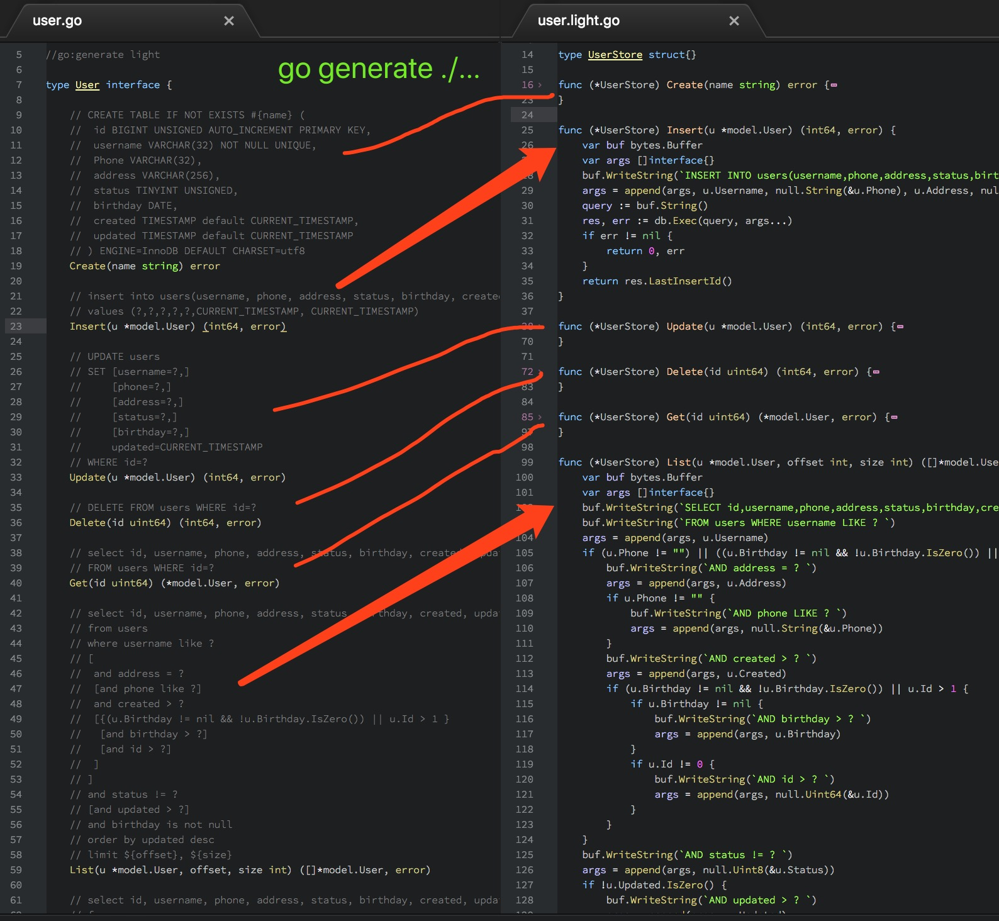

light [](https://api.travis-ci.org/arstd/light.svg?branch=master)
=====


`light` is a tool for generating database query code from go source file with
interface methods commented with SQLs and Variables.

`Interface methods commented with SQL and variables` => `go generate`=> `Database query code implementation`



### Usage

Install `light` tool. Make sure $GOBIN in your $PATH environment.

    `go get -u -v github.com/arstd/light`

Run `light -h`, check install.

    # light -h
    Usage of light:
      -log
        	Generated file with log

Define a interface, and comment methods with SQLs and Variables, then write a directive `//go:generate light`.

```go
//go:generate light -log -timeout 30

type User interface {
    // UPDATE users
    // SET [username=?,]
    //     [phone=?,]
    //     [address=?,]
    //     [status=?,]
    //     [birthday=?,]
    //     updated=CURRENT_TIMESTAMP
    // WHERE id=?
    Update(u *model.User) (int64, error)
}
```

After that, run `go generate ./...`, code generated.

	# go generate ./...
	Source file    /Users/Arstd/Reposits/src/github.com/arstd/light/example/store/user.go
	Generated file /Users/Arstd/Reposits/src/github.com/arstd/light/example/store/user.light.go

```go

type UserStore struct{}

func (*UserStore) Update(u *model.User) (int64, error) {
	var buf bytes.Buffer
	var args []interface{}
	buf.WriteString(`UPDATE users SET `)
	if u.Username != "" {
		buf.WriteString(`username=?, `)
		args = append(args, u.Username)
	}
	if u.Phone != "" {
		buf.WriteString(`phone=?, `)
		args = append(args, null.String(&u.Phone))
	}
	if u.Address != nil {
		buf.WriteString(`address=?, `)
		args = append(args, u.Address)
	}
	if u.Status != 0 {
		buf.WriteString(`status=?, `)
		args = append(args, null.Uint8(&u.Status))
	}
	if u.Birthday != nil {
		buf.WriteString(`birthday=?, `)
		args = append(args, u.Birthday)
	}
	buf.WriteString(`updated=CURRENT_TIMESTAMP WHERE id=? `)
	args = append(args, null.Uint64(&u.Id))
	query := buf.String()
	log.Debug(query)
	log.Debug(args...)
	res, err := db.Exec(query, args...)
	if err != nil {
		log.Error(query)
		log.Error(args...)
		log.Error(err)
		return 0, err
	}
	return res.RowsAffected()
}
```

### More

Complete demo in example.

Source interface: [example/store/user.go](example/store/user.go)

Generated code: [example/store/user.light.go](example/store/user.light.go)
